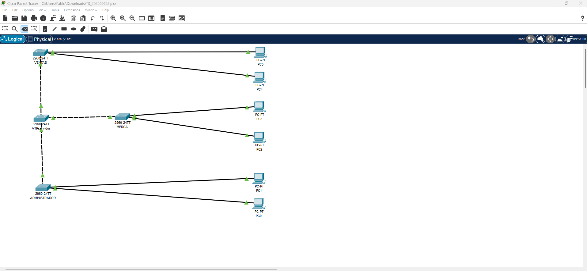
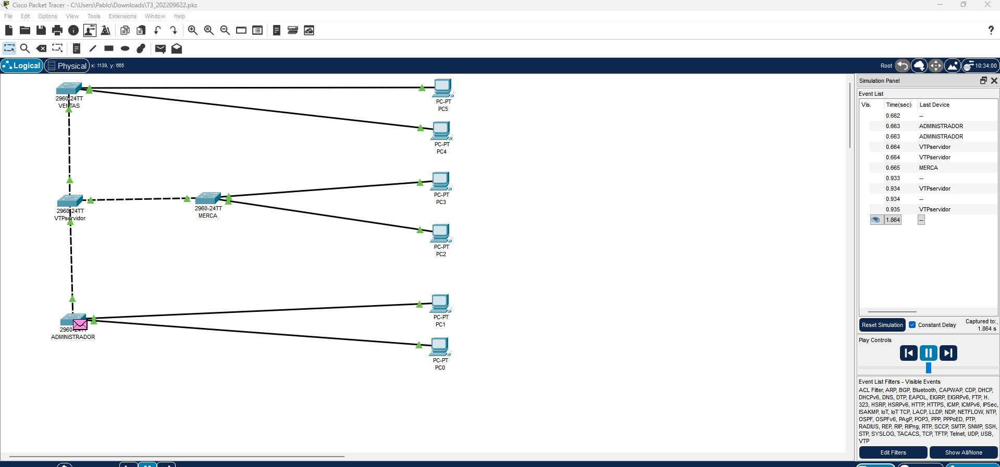
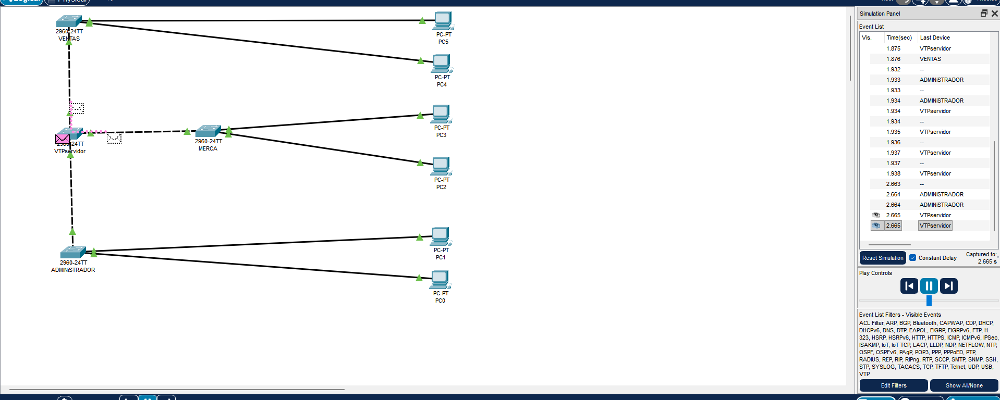

# Tarea 3 - VLANs y VTP en Cisco Packet Tracer

Universidad de San Carlos de Guatemala
Facultad de Ingeniería - Escuela de Ingeniería en Ciencias y Sistemas
Laboratorio de Redes de Computadoras 1, Sección A - Segundo Semestre 2026

Nombre: Pablo Cutzal
Carné: 202209622

---

## 1. Descripción

Se armó una red en Packet Tracer con 4 switches 2960 y 6 PCs. El switch central (Switch0) trabaja
como servidor VTP y propaga las VLANs hacia los switches de acceso. ADMIN y MERCA están en modo
cliente, por lo que reciben las VLANs automáticamente, y VENTAS está en modo transparente, así que
sus VLANs se tuvieron que crear a mano.

Dominio VTP usado: `REDES1`
Versión de VTP: 2

## 2. Topología

```
                        [ Switch0 ]  (VTP Server)
                      Fa0/1 Fa0/2 Fa0/3
                        |     |     |
            +-----------+     |     +-----------+
            | trunk           | trunk           | trunk
        [ ADMIN ]         [ MERCA ]         [ VENTAS ]
       (VTP Client)      (VTP Client)     (VTP Transparent)
        Fa0/2 Fa0/3       Fa0/2 Fa0/3       Fa0/2 Fa0/3
          |     |           |     |           |     |
        PC0   PC1         PC2   PC3         PC4   PC5
       VLAN 10           VLAN 20           VLAN 30
```

Topología armada en Packet Tracer:



Cables:

- Switch a switch: cable cruzado (Copper Cross-Over).
- PC a switch: cable directo (Copper Straight-Through).

### Tabla de puertos

| Dispositivo | Puerto | Conecta a | Modo |
|---|---|---|---|
| Switch0 | Fa0/1 | ADMIN Fa0/1 | trunk |
| Switch0 | Fa0/2 | MERCA Fa0/1 | trunk |
| Switch0 | Fa0/3 | VENTAS Fa0/1 | trunk |
| ADMIN | Fa0/1 | Switch0 Fa0/1 | trunk |
| ADMIN | Fa0/2 - Fa0/3 | PC0, PC1 | access VLAN 10 |
| MERCA | Fa0/1 | Switch0 Fa0/2 | trunk |
| MERCA | Fa0/2 - Fa0/3 | PC2, PC3 | access VLAN 20 |
| VENTAS | Fa0/1 | Switch0 Fa0/3 | trunk |
| VENTAS | Fa0/2 - Fa0/3 | PC4, PC5 | access VLAN 30 |

### Direccionamiento

| PC | VLAN | Nombre VLAN | Dirección IP | Máscara | Switch |
|---|---|---|---|---|---|
| PC0 | 10 | ADMIN | 192.168.10.10 | 255.255.255.0 | ADMIN |
| PC1 | 10 | ADMIN | 192.168.10.11 | 255.255.255.0 | ADMIN |
| PC2 | 20 | MERCA | 192.168.20.20 | 255.255.255.0 | MERCA |
| PC3 | 20 | MERCA | 192.168.20.21 | 255.255.255.0 | MERCA |
| PC4 | 30 | VENTAS | 192.168.30.30 | 255.255.255.0 | VENTAS |
| PC5 | 30 | VENTAS | 192.168.30.31 | 255.255.255.0 | VENTAS |

No se configuró gateway porque no hay enrutamiento entre VLANs en esta práctica.

## 3. Orden en que se configuró

1. Primero los enlaces trunk entre los switches. Si los trunks no están arriba, VTP no propaga nada.
2. Después el dominio VTP y el modo de cada switch.
3. Luego las VLANs en el servidor (y a mano en el transparente).
4. Al final los puertos de acceso y las IP de las PCs.

## 4. Scripts de configuración

### 4.1 Switch0 (servidor VTP)

```
enable
configure terminal
hostname Switch0
!
interface range fa0/1 - 3
 switchport mode trunk
 no shutdown
exit
!
vtp domain REDES1
vtp version 2
vtp mode server
!
vlan 10
 name ADMIN
exit
vlan 20
 name MERCA
exit
vlan 30
 name VENTAS
exit
!
end
write memory
```

### 4.2 Switch ADMIN (cliente VTP)

```
enable
configure terminal
hostname ADMIN
!
interface fa0/1
 switchport mode trunk
 no shutdown
exit
!
vtp domain REDES1
vtp version 2
vtp mode client
!
interface range fa0/2 - 3
 switchport mode access
 switchport access vlan 10
 no shutdown
exit
!
end
write memory
```

Las VLANs no se crean aquí, llegan solas desde Switch0. Si `show vlan brief` no muestra la 10, 20 y 30
es que el trunk o el dominio están mal.

### 4.3 Switch MERCA (cliente VTP)

```
enable
configure terminal
hostname MERCA
!
interface fa0/1
 switchport mode trunk
 no shutdown
exit
!
vtp domain REDES1
vtp version 2
vtp mode client
!
interface range fa0/2 - 3
 switchport mode access
 switchport access vlan 20
 no shutdown
exit
!
end
write memory
```

### 4.4 Switch VENTAS (transparente VTP)

```
enable
configure terminal
hostname VENTAS
!
interface fa0/1
 switchport mode trunk
 no shutdown
exit
!
vtp domain REDES1
vtp version 2
vtp mode transparent
!
vlan 10
 name ADMIN
exit
vlan 20
 name MERCA
exit
vlan 30
 name VENTAS
exit
!
interface range fa0/2 - 3
 switchport mode access
 switchport access vlan 30
 no shutdown
exit
!
end
write memory
```

Aquí sí hay que crear las VLANs manualmente. Un switch transparente reenvía los anuncios VTP hacia
los demás switches pero no actualiza su propia base de datos de VLANs.

## 5. Verificación

### 5.1 show vtp status

Comando ejecutado en cada switch:

```
show vtp status
```

Salida esperada en Switch0:

```
VTP Version                     : 2
Configuration Revision          : 3
Maximum VLANs supported locally : 255
Number of existing VLANs        : 8
VTP Operating Mode              : Server
VTP Domain Name                 : REDES1
```

En ADMIN y MERCA el modo debe decir `Client` y el número de revisión debe ser el mismo que el del
servidor. En VENTAS el modo dice `Transparent` y la revisión se queda en 0, lo cual es normal.

Capturas:



### 5.2 show vlan brief

```
show vlan brief
```

Salida esperada en ADMIN (las VLANs llegaron por VTP):

```
VLAN Name          Status    Ports
---- ------------- --------- -------------------------------
1    default       active    Fa0/4, Fa0/5, Fa0/6 ...
10   ADMIN         active    Fa0/2, Fa0/3
20   MERCA         active
30   VENTAS        active
```

La captura de estos comandos está en la imagen de verificación de la sección anterior.

### 5.3 Verificación de los trunks

```
show interfaces trunk
```

Los tres enlaces del switch central deben aparecer en modo `on` y con las VLANs 10, 20 y 30 permitidas.

## 6. Pruebas de conectividad

| Origen | Destino | VLAN origen | VLAN destino | Resultado esperado |
|---|---|---|---|---|
| PC0 (192.168.10.10) | PC1 (192.168.10.11) | 10 | 10 | Exitoso |
| PC2 (192.168.20.20) | PC3 (192.168.20.21) | 20 | 20 | Exitoso |
| PC4 (192.168.30.30) | PC5 (192.168.30.31) | 30 | 30 | Exitoso |
| PC0 (192.168.10.10) | PC2 (192.168.20.20) | 10 | 20 | Falla |
| PC2 (192.168.20.20) | PC4 (192.168.30.30) | 20 | 30 | Falla |
| PC0 (192.168.10.10) | PC4 (192.168.30.30) | 10 | 30 | Falla |

### Ping exitoso (misma VLAN)

```
C:\>ping 192.168.10.11

Pinging 192.168.10.11 with 32 bytes of data:

Reply from 192.168.10.11: bytes=32 time<1ms TTL=128
Reply from 192.168.10.11: bytes=32 time<1ms TTL=128
Reply from 192.168.10.11: bytes=32 time<1ms TTL=128
Reply from 192.168.10.11: bytes=32 time<1ms TTL=128

Ping statistics for 192.168.10.11:
    Packets: Sent = 4, Received = 4, Lost = 0 (0% loss)
```



### Ping fallido (distintas VLANs)

```
C:\>ping 192.168.20.20

Pinging 192.168.20.20 with 32 bytes of data:

Request timed out.
Request timed out.
Request timed out.
Request timed out.

Ping statistics for 192.168.20.20:
    Packets: Sent = 4, Received = 0, Lost = 4 (100% loss)
```

Nota: al usar una subred distinta por VLAN, la PC ni siquiera saca el paquete de su red local, así que
puede aparecer "Destination host unreachable" en lugar de "Request timed out". El resultado es el mismo,
no hay comunicación entre VLANs porque no existe ningún dispositivo de capa 3 que haga el ruteo entre
ellas.

## 7. Problemas encontrados

- Al principio los switches cliente no recibían las VLANs. El problema era que los enlaces entre switches
  estaban en modo dinámico y no habían levantado como trunk. Se corrigió forzando `switchport mode trunk`
  en los dos extremos.
- El switch VENTAS aparecía sin las VLANs aunque el dominio era el mismo. Es el comportamiento normal del
  modo transparente, las VLANs se crearon de forma local.
- Si un switch en modo cliente llega con un número de revisión más alto puede sobrescribir las VLANs del
  dominio. Para reiniciar el contador se pasa el switch a `vtp mode transparent`, se regresa a
  `vtp mode client` y con eso la revisión vuelve a 0.

## 8. Conclusiones

- VTP evita tener que crear las mismas VLANs switch por switch, con el servidor es suficiente y los
  clientes se sincronizan solos siempre que compartan dominio y tengan trunks activos.
- El modo transparente sirve cuando un switch necesita sus propias VLANs sin depender del dominio, pero
  obliga a administrarlo de forma manual.
- Las VLANs aíslan el tráfico a nivel de capa 2. Aunque las PCs estén físicamente conectadas a la misma
  infraestructura, si están en VLANs distintas no se ven entre ellas mientras no exista enrutamiento
  inter-VLAN.

## 9. Archivos entregados

```
Tarea 3/
├── Manual.md
├── Tarea3_202209622.pkt
├── topologia.png
├── verificacion.png
└── pings.png
```
